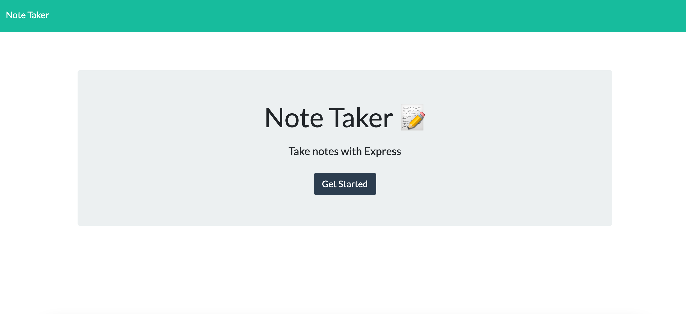
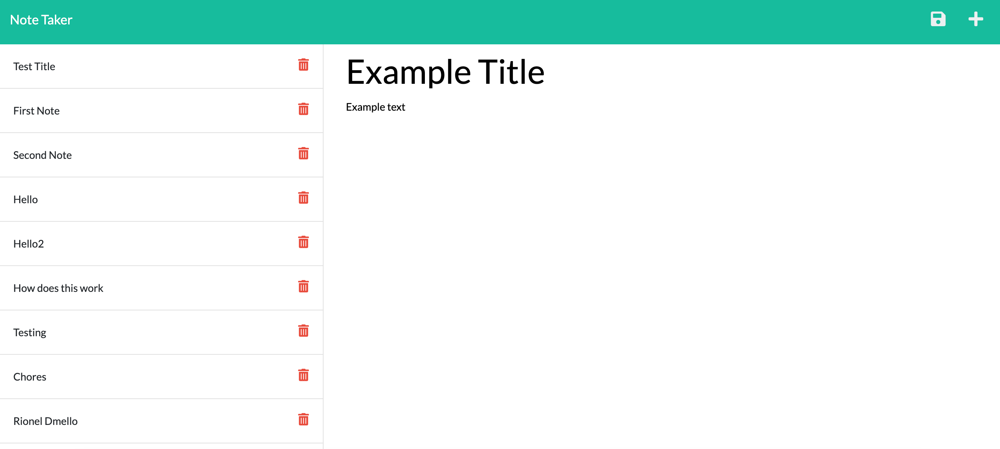

# Note Taking App

## This app was created in order to allow for simple, easy and efficient note-taking for users. By working on this app, i learned to set up the backend of an application and connect it to the front end. In order to do this, i learned to utilize express to set up a server, Insomnia to ensure my server was running HTTP methods, and Heroku to run my app on a cloud.

## Links

- Repository: https://github.com/bburton5/note-taking-app
- Heroku: https://obscure-cliffs-46021.herokuapp.com/

## Usage

## Credits

- StackOverflow
- MDN
- w3schools
- Open Weather API
- npm
